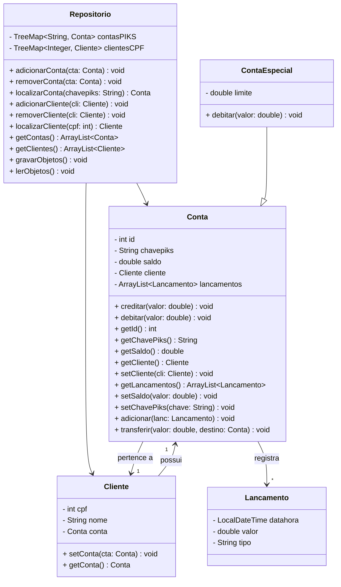

# 💱 Sistema PIKS
> IFPB/JP – TSI – Programação Orientada a Objetos (Prof. Fausto Ayres). Projeto 2.

### Objetivo: Implementar o sistema de transferência bancária PIKS.
---
## ➡️ Requisito de Dados (classes)

